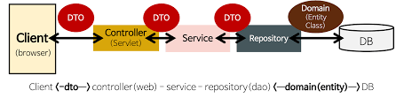

# Spring Boot 구조

## Controller
- 클라이언트로부터 요청을 받아 적절한 메서드를 호출해서 결괏값을 받는다
- 클라이언트로부터 들어오는 HTTP 요청을 받아서 처리하고 결과를 HTTP 응답으로 반환한다

## Entity
- DB 테이블을 생성할때 쿼리 작성과정을 생략하게 해준다
- DB 테이블에 대응하는 클래스
- DB에서 쓰일 테이블과 컬럼을 생성하고 정의한다

## Repository
- 엔티티가 생성한 DB에 접근하는데 사용된다

## DTO
- Data Transfer Object의 약자
- 다른 레이어 간의 데이터 교환에 활용
- 클래스 및 인터페이스를 호출하면서 전달하는 매개변수로 사용된다
- 데이터 교환용으로만 사용되는 데이터 객체이다

## Service
- 앱에서 제공하는 핵심 기능을 제공한다
- 추상화해서 구성한다
- 클래스에서 클라이언트가 요청한 데이터를 적절하게 가공해서 컨트롤러에게 넘긴다
